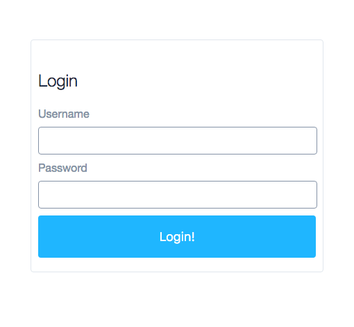

# React Zest Playground

## OVERVIEW

This is a small playground for adding and testing [React Zest](https://www.npmjs.com/package/react-zest) animations. The goal is to let you get a feel for using the Wrapper API in an existing React application.

#### SCREENSHOT

## UP & RUNNING

- `npm install` _or_ `yarn` _if you have [Yarn](https://www.npmjs.com/package/@whitecolor/yarn) installed._
- `npm start`
- visit `http://localhost:8080/`

## ADDING SOME ZEST

- `npm install --save react-zest` _or_ `yarn add react-zest` _if you have [Yarn](https://www.npmjs.com/package/@whitecolor/yarn) installed._
- View the [React Zest README](https://github.com/TheCognizantFoundry/react-zest/#example-usage) for usage documentation.
